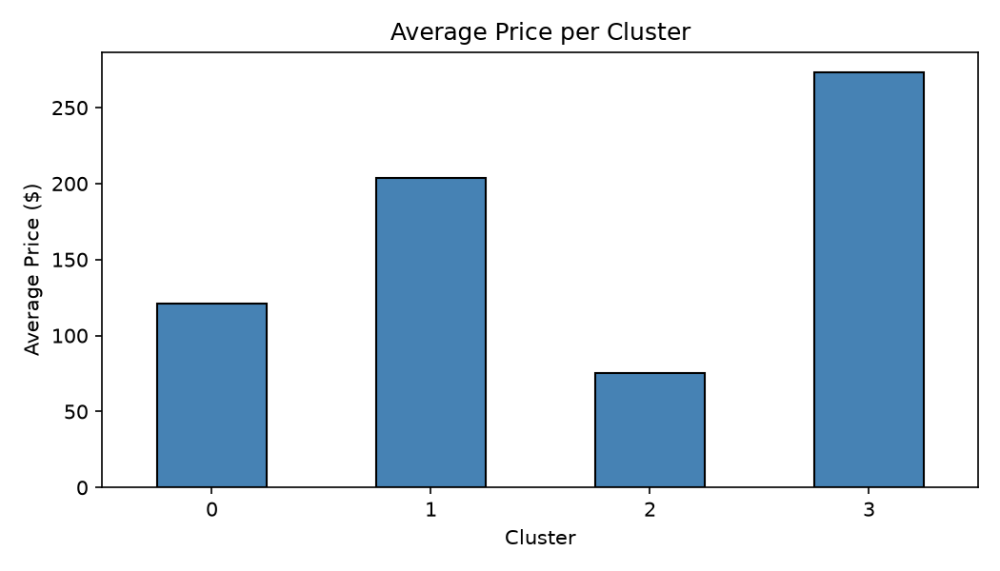

# NYC Airbnb Market Segmentation using K-Means Clustering

## Project Overview
This project analyzes Airbnb listings in New York City using K-Means clustering to identify market segments based on price, location, and listing characteristics.

## Methodology
1. Data Cleaning
2. Feature Selection
3. Elbow Method for optimal clusters
4. Silhouette Score evaluation
5. K-Means Clustering

## Visualizations
- Elbow Plot
- Silhouette Plot
- Price Distribution per Cluster
- Neighborhood Distribution per Cluster

## Project Structure

data/ – dataset files  
notebooks/ – clustering notebook  
visuals/ – plots and charts  
reports/ – project report  

## Technologies Used
- Python
- Pandas
- Scikit-learn
- Matplotlib
- Seaborn
- Jupyter Notebook
