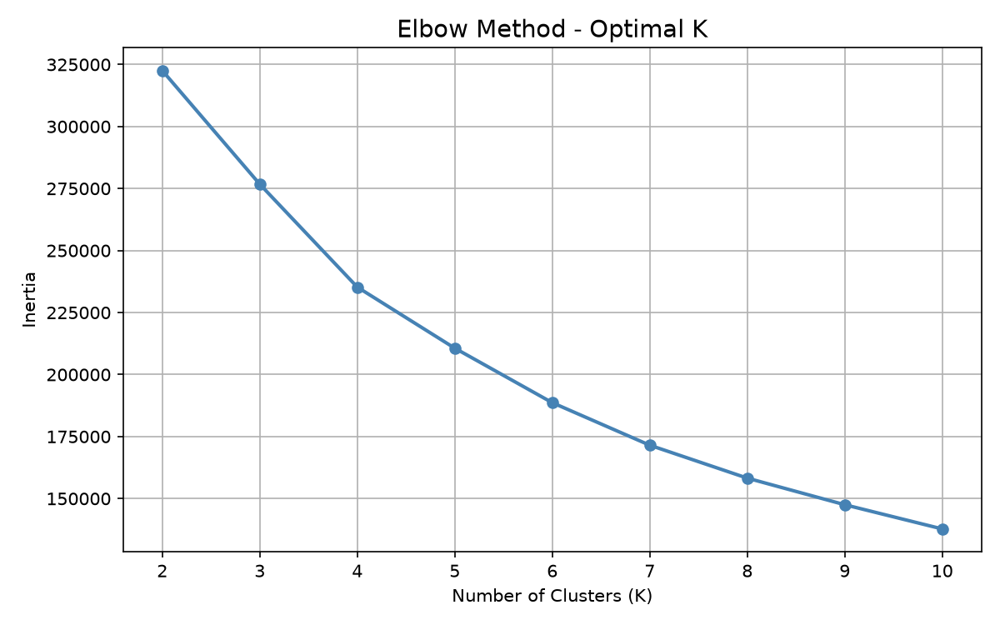
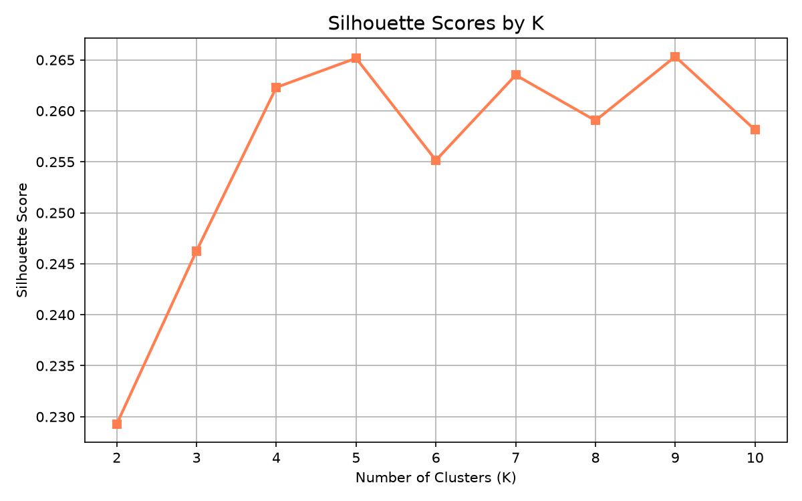
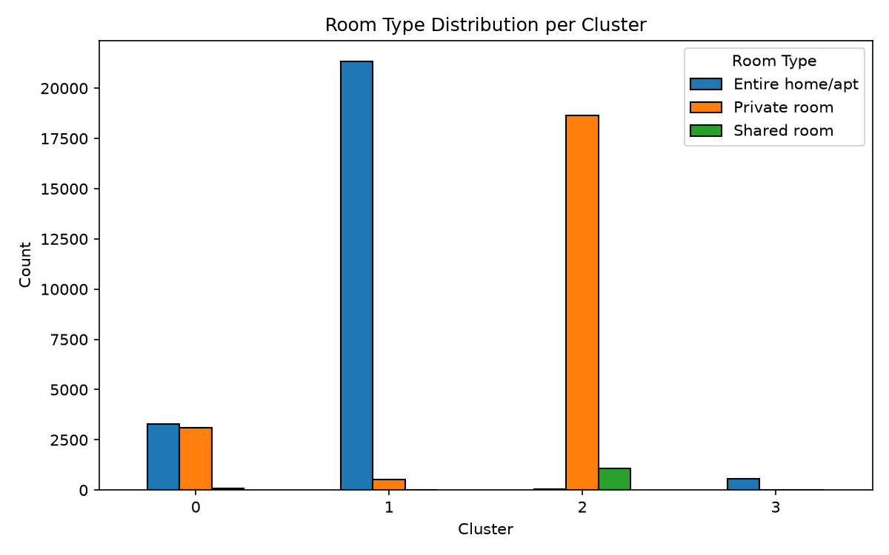
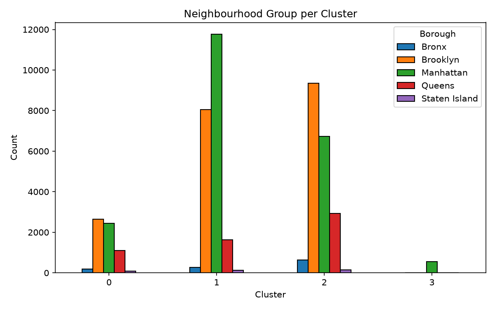

# Clustering Analysis Report

This report documents the methodology and results of the K-Means clustering
analysis performed on the NYC Airbnb 2019 dataset. It is a Markdown
conversion of the original `Section_C_report.docx`, preserving the analysis
content in a repo-native, diff-friendly format.

## 1. Clustering Approach

K-Means clustering was applied to identify distinct market segments within
the NYC Airbnb dataset. Eight features were selected for clustering:
log-transformed price, minimum nights, number of reviews, reviews per month,
availability over 365 days, host listing count, neighbourhood group, and
room type.

The two categorical variables — neighbourhood group and room type — were
label-encoded into numeric values to ensure compatibility with the
algorithm. All features were then standardised using `StandardScaler`,
transforming them to zero mean and unit variance, which prevents features
with larger numeric ranges from dominating the distance calculations.

The optimal number of clusters was determined by combining:

- **The Elbow Method**, which plots within-cluster inertia against K.
- **The Silhouette Score**, which measures cluster cohesion and separation.

The elbow curve showed a visible bend at **K=4**, and the silhouette
analysis confirmed K=4 as a strong choice (**score: 0.262**), balancing
interpretability and statistical validity. Each cluster was subsequently
profiled by computing mean values of key variables and examining
distributions of room type and borough.

*Figure 1: Elbow Method — Inertia vs Number of Clusters (K). The curve bends
at K=4, indicating the optimal cluster count.*

*Figure 2: Silhouette Scores by K. K=4 achieves a score of 0.262, confirming
it as the optimal number of clusters.*

## 2. Clustering Results

K-Means clustering with K=4 successfully identified four distinct listing
segments in the NYC Airbnb market, each with a clear and interpretable
profile:

- **Cluster 0 — Mid-Range Mixed Listings**: averaging $121/night with a
  balanced split between entire homes (51%) and private rooms (48%), spread
  across Brooklyn (41%) and Manhattan (38%). This segment also has the
  highest review activity (~106 reviews and 4.0 reviews/month on average),
  suggesting established, frequently-booked listings.
- **Cluster 1 — High-Value Entire Homes**: an average price of $203 and 98%
  entire home/apartment listings concentrated in Manhattan (54%), reflecting
  premium urban accommodation with longer minimum stays (~9 nights).
- **Cluster 2 — Budget Private Rooms**: the lowest average price at $76,
  with 94% private rooms, predominantly located in Brooklyn (47%),
  indicating affordable short-stay options in the outer boroughs.
- **Cluster 3 — Long-Stay Luxury Apartments**: the highest average price at
  $273, with 98% entire homes almost exclusively in Manhattan (99%), and a
  notably high minimum stay of ~30 nights on average, suggesting
  monthly/corporate or executive rentals. This is also the smallest segment
  by listing count.

Availability also varied meaningfully, with Cluster 3 listings available
~282 days per year compared to just ~99 days for Cluster 1, indicating very
different hosting strategies across segments.

*Figure 3: Average Price per Cluster. Cluster 3 (Long-Stay Luxury) commands
the highest price at $273, while Cluster 2 (Budget) averages $76.*

*Figure 4: Room Type Distribution per Cluster. Clusters 1 and 3 are almost
entirely entire homes, while Cluster 2 is dominated by private rooms.*

*Figure 5: Neighbourhood Group Distribution per Cluster. Cluster 3 is almost
entirely Manhattan, while Clusters 0 and 2 are spread across Brooklyn and
the outer boroughs.*

### Table 1: Cluster Profile Summary

| Cluster | Label                    | Avg Price | Dominant Room Type      | Main Borough    | Listings |
|---------|---------------------------|-----------|--------------------------|------------------|----------|
| 0       | Mid-Range Mixed           | $121      | Entire/Private (51/48%)  | Brooklyn (41%)   | 6,465    |
| 1       | High-Value Entire Homes   | $203      | Entire home (98%)        | Manhattan (54%)  | 21,839   |
| 2       | Budget Private Rooms      | $76       | Private room (94%)       | Brooklyn (47%)   | 19,777   |
| 3       | Long-Stay Luxury Apts     | $273      | Entire home (98%)        | Manhattan (99%)  | 564      |

## 3. Summary

The four clusters map cleanly onto recognizable NYC short-term rental
segments — an established mid-market segment, premium Manhattan-heavy
entire-home listings, budget outer-borough private rooms, and a small but
distinct long-stay/luxury Manhattan segment. These segments could inform
pricing strategy, host guidance, and targeted marketing for a platform
operating in this space.
